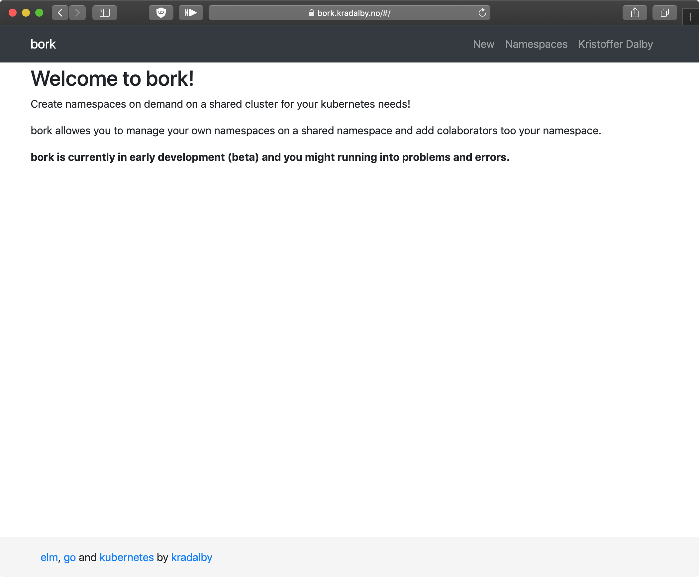
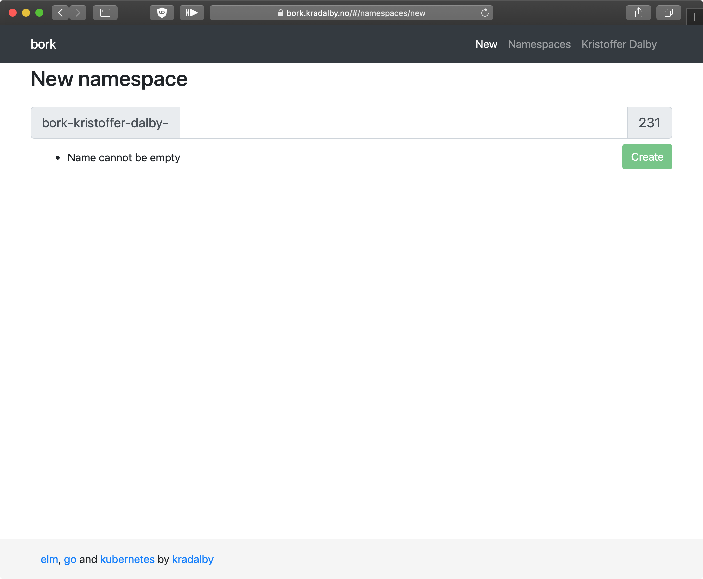
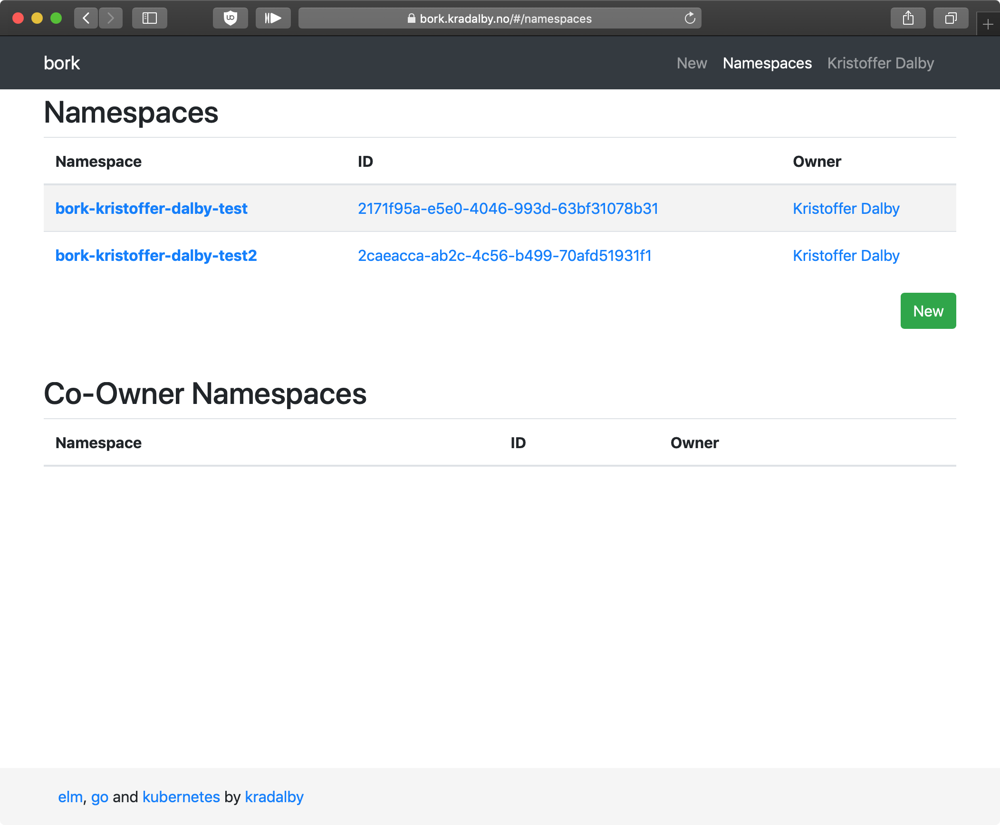
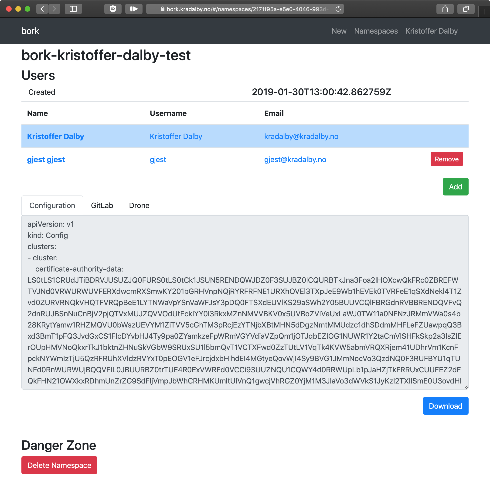
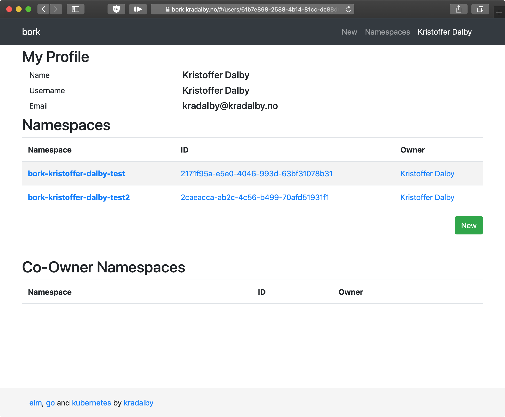

# Bork

Bork aims to allow user to log in with their OpenID account to create namespaces on a shared Kubernetes cluster.

It is very early development.

## Currently implemented

* Web UI with creation of namespaces
* Simple namespace creation
* Namespaces are created with restricted access
* Namespaces can be shared with multiple co-owners
* Per namespace CI setup instruction (GitLab, Drone)

## WIP screenshots

